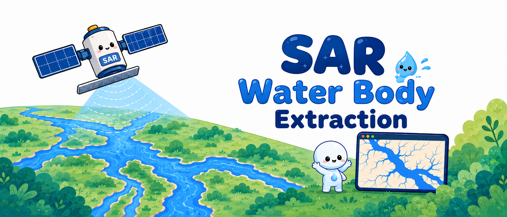

# 🛰️ SAR Water Body Extraction 🌊



**A machine learning pipeline for water body extraction from Synthetic Aperture Radar (SAR) imagery using GLCM + LBP + Wavelet texture features.**

This repository provides the open-source, reproducible component of a cross-sensor water extraction framework. It includes:

- **Sentinel-1 GNDPI algorithm** for water enhancement (Google Earth Engine)
- **Multi-feature extraction** pipeline (GLCM + LBP + Haar wavelet)
- **Multiple classifiers** (Random Forest, SVM, XGBoost) with cross-validation
- **SHAP model interpretability** analysis
- **End-to-end workflow** from SAR image to classified water map

---

## Repository Structure

```
SAR-Water-Extraction/
├── README.md
├── LICENSE
├── requirements.txt
├── .gitignore
│
├── gee/
│   └── s1_gndpi.js              # GEE S1-GNDPI water index
│
├── src/
│   ├── main.py                   # Main pipeline entry point
│   ├── config.yaml               # Configuration template
│   ├── preprocessing.py          # SAR image I/O
│   ├── feature_extraction.py     # GLCM + LBP + Wavelet features
│   ├── model_training.py         # RF / SVM / XGBoost training
│   ├── classification.py         # Full-image classification
│   ├── shap_analysis.py          # SHAP interpretability
│   └── utils.py                  # Logging & visualization
│
├── feature_scripts/
│   ├── glcm_features.py          # Standalone GLCM demo
│   ├── wavelet_features.py       # Standalone wavelet demo
│   └── lbp_features.py           # Standalone LBP demo
│
└── docs/
    └── DATA_AVAILABILITY.md      # Data policy & reproducibility
```

---

## Quick Start

### 0. Try the demo (3 minutes)

A fully-synthetic 100x100 SAR image with labeled water/land polygons is included for instant testing:

```bash
cd example
python generate_demo_data.py       # Generate demo data (already included)
cd ../src
python main.py --config ../example/demo_config.yaml
```

Results appear in `example/output/` — classification map, confusion matrix, trained model.

### 1. Install dependencies

```bash
pip install -r requirements.txt
```

### 2. Prepare your data

- **SAR image**: A single-band GeoTIFF (e.g., Sentinel-1 GRD backscatter in dB)
- **Labels**: A polygon Shapefile with a `label` column (0 = non-water, 1 = water)

Place them in an `input/` directory (or anywhere), then edit `src/config.yaml`:

```yaml
paths:
  tif_path: "input/your_sar_image.tif"
  label_shp_path: "input/your_labels.shp"
  output_dir: "output"
```

### 3. Run the pipeline

```bash
cd src
python main.py                    # Random Forest (default)
python main.py --model svm        # SVM
python main.py --model xgboost    # XGBoost
```

### 4. Run SHAP analysis

After training, use the saved model for interpretability:

```python
from shap_analysis import run_shap_analysis

run_shap_analysis(
    model_path="output/random_forest_model.joblib",
    scaler_path="output/scaler.joblib",
    features_path="output/features.npy",
    labels_path="output/labels.npy",
    output_dir="output/shap_output"
)
```

---

## Methodology

### Feature Extraction

Three complementary texture feature families are extracted from each pixel's local window:

| Feature Family | Dimensionality | Description |
|---------------|---------------|-------------|
| **GLCM** (Gray-Level Co-occurrence Matrix) | 5 | Contrast, dissimilarity, homogeneity, energy, correlation |
| **LBP** (Local Binary Pattern) | 10 | Uniform LBP histogram (P=8, R=1) |
| **Wavelet** (Haar DWT) | 8 | Mean & variance of cA, cH, cV, cD sub-bands |
| **Total** | **23** | Concatenated feature vector |

### Classifiers

- **Random Forest** (default): 100 trees, max_depth=10
- **SVM**: RBF kernel, C=1.0
- **XGBoost**: Gradient boosting with histogram tree method

### S1-GNDPI

The `gee/s1_gndpi.js` script implements the Sentinel-1 Generalized Normalized Difference Polarimetric Index:

```
GNDPI = 0.5 * ln(VV_linear + VH_linear) + 1.90
```

This index enhances water-land contrast in dual-polarization SAR data. Run it directly in the [Google Earth Engine Code Editor](https://code.earthengine.google.com/).

---

## Data Availability Statement

> **Important**: Due to China's data security and distribution policies (《中华人民共和国测绘法》《中华人民共和国数据安全法》), the GF-3 (Gaofen-3) original SAR imagery and high-resolution derivative products of flood detention areas used in the associated study **cannot be publicly distributed**.
>
> To ensure full reproducibility, we have open-sourced:
> 1. The complete cross-sensor validation pipeline using globally available **Sentinel-1** data
> 2. The **S1-GNDPI** algorithm implemented on Google Earth Engine
> 3. All machine learning code (feature extraction, model training, classification, SHAP analysis)
>
> Researchers can reproduce the methodology using their own Sentinel-1 data by following the instructions in this repository. Sentinel-1 data is freely available from the [Copernicus Open Access Hub](https://scihub.copernicus.eu/) or [Google Earth Engine](https://earthengine.google.com/).
>
> For detailed data policy, see [docs/DATA_AVAILABILITY.md](docs/DATA_AVAILABILITY.md).

---

## Acknowledgments

We sincerely thank the editor and anonymous reviewers for their constructive comments and dedicated efforts in handling our manuscript. If you are reading this — please accept my highest respect and gratitude. Your rigorous review has greatly improved this work.

---

## Citation

If you use this code in your research, please cite:

> *Preparing*

---

## License

This project is licensed under the MIT License — see [LICENSE](LICENSE) for details.

---

## Contact

For questions or collaboration inquiries, please open a GitHub Issue.
